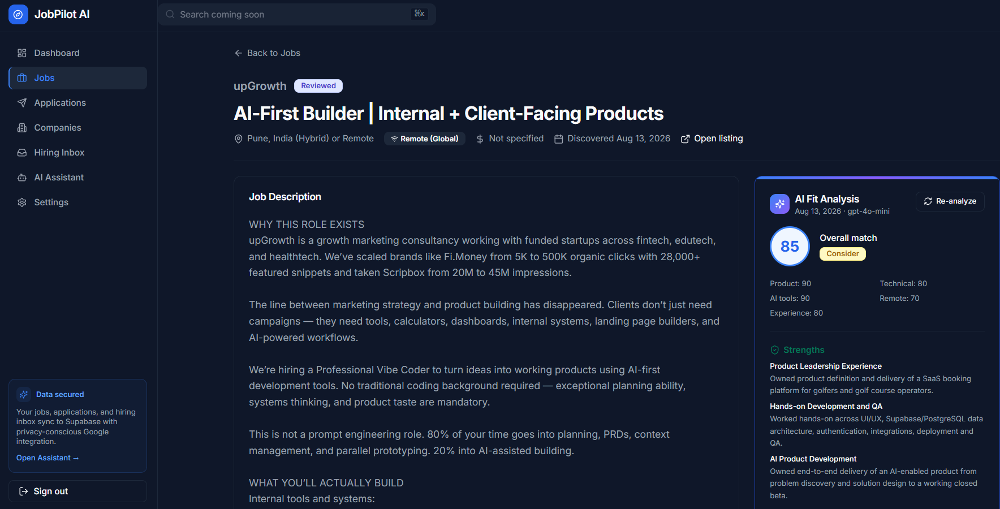
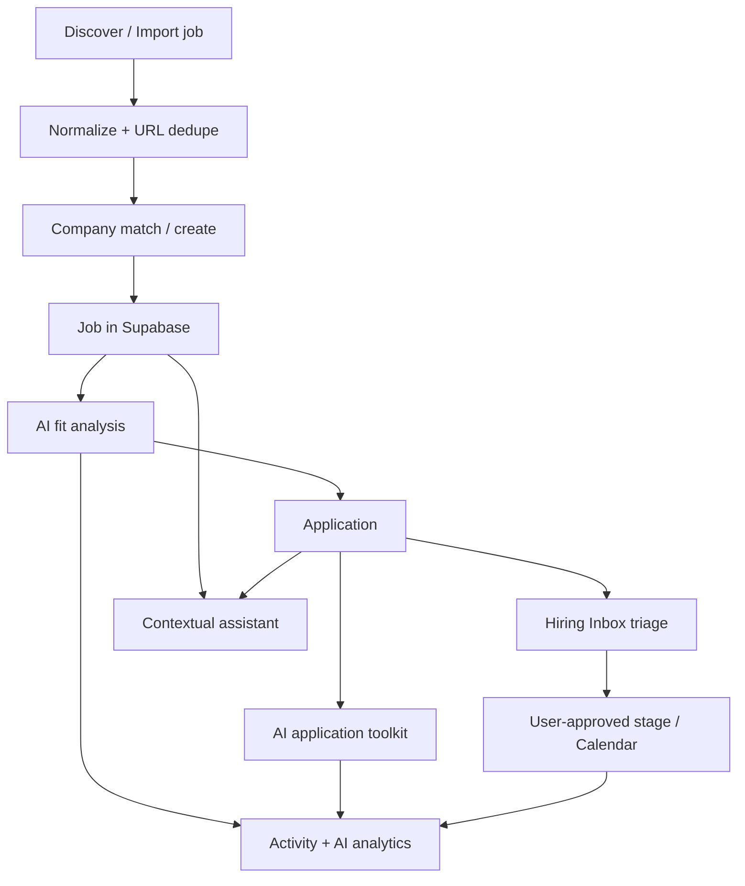
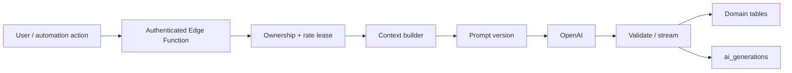
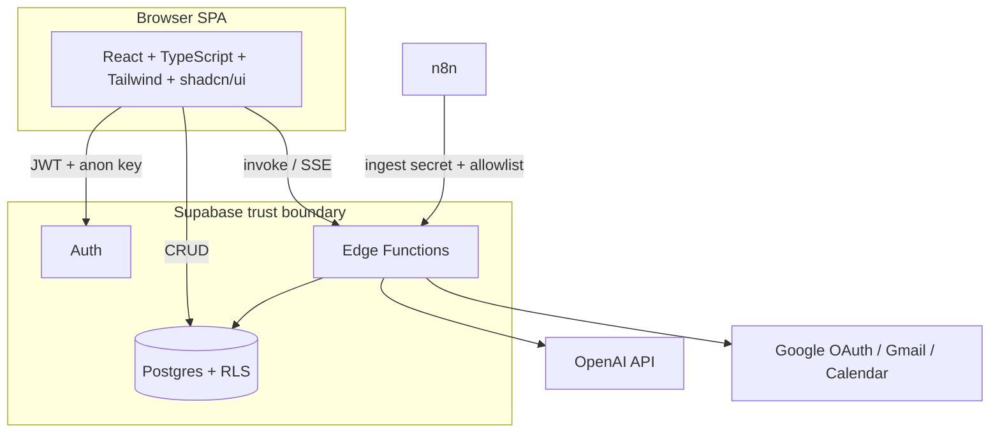
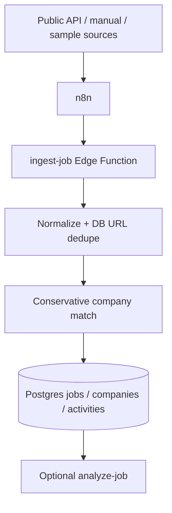
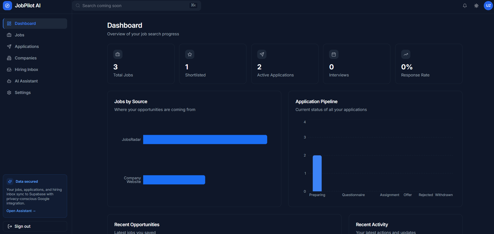
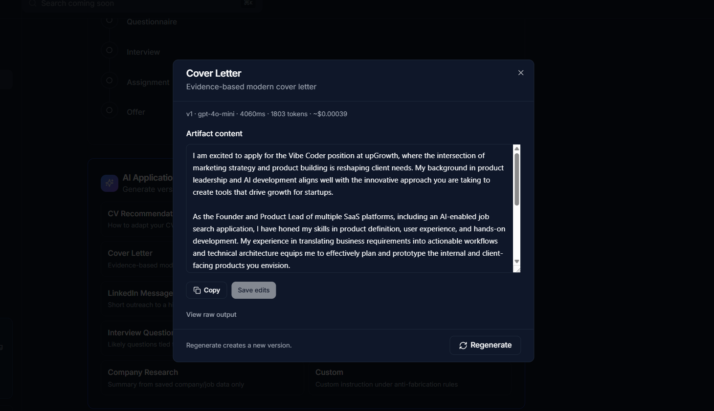
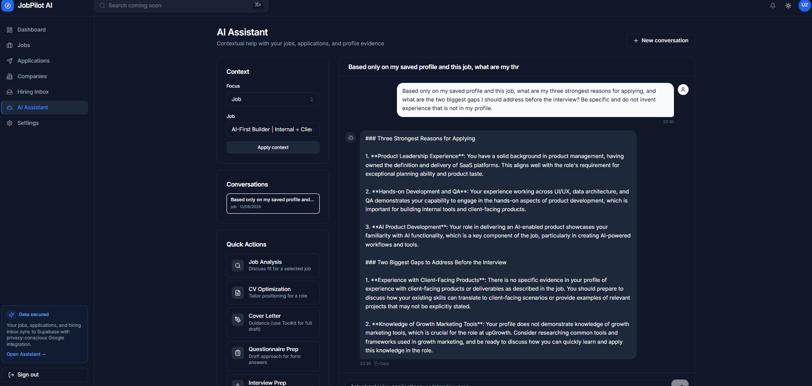
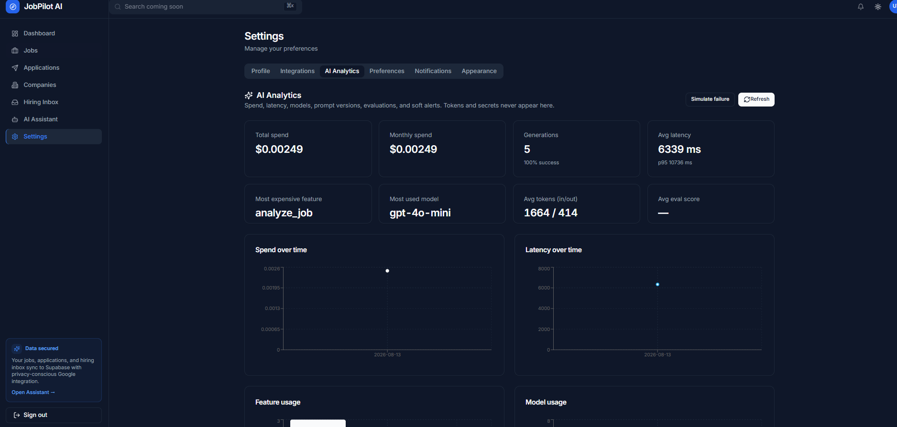

# JobPilot AI

**An AI-native workspace for discovering, evaluating, managing, and preparing for job opportunities.**

I built JobPilot AI end-to-end — product definition, UX flows, architecture, full-stack implementation, AI orchestration, Google and n8n integrations, QA, security hardening, and production-readiness auditing (Phases 5A–5E). The system is a multi-tenant Supabase app with structured AI workflows (fit analysis, versioned artifacts, streaming assistant, Gmail classification, central observability), not a generic chat wrapper.

[](https://react.dev/)
[](https://www.typescriptlang.org/)
[](https://supabase.com/)
[](https://openai.com/)
[](https://n8n.io/)

## Contents

- [Product](#what-jobpilot-ai-does)
- [AI System](#ai-system-design)
- [Architecture & Automation](#architecture)
- [Security & Reliability](#security--multi-tenant-design)
- [Observability](#ai-observability--cost-control)
- [Tech Stack](#tech-stack)
- [Documentation](#documentation)

## Why This Project Matters

- **Problem → working software:** Job search fragments across boards, spreadsheets, email, and ad-hoc AI; JobPilot unifies discovery, evaluation, application prep, and hiring follow-up in one authenticated workflow.
- **AI as structured product paths:** Fit analysis, artifacts, assistant, and Gmail classification are separate Edge workflows with validation and observability — not one undifferentiated prompt.
- **Security, reliability, and cost as product concerns:** RLS, rate limits, human approval gates, AI spend/latency logging, and readiness runbooks are built in, not bolted on after the fact.



**AI-powered job fit analysis** — Structured, evidence-bounded evaluation across product, technical, AI-tooling, remote-work, and experience dimensions.

## AI-Assisted Development Workflow

Build process (tools ≠ runtime):

**Product reasoning / specification → Bolt.new rapid UI prototype → Cursor implementation & debugging → Supabase schema/RLS evolution → QA & hardening**

| Tool | Role |
|------|------|
| **Bolt.new** | Early UI/product prototyping (React + shadcn/Tailwind scaffolding) |
| **Cursor** | Implementation, architecture, debugging, hardening, docs |
| **ChatGPT** | Product/prompt workflow design alongside coded prompts (`src/lib/ai/`, Edge) |
| **Supabase CLI / migrations** | Schema, RLS, RPCs (`supabase/migrations/`, `db:types`, `db:push`) |

Runtime architecture remains React + Supabase (Auth, Postgres, Edge) + OpenAI + n8n + Google APIs.

---

## Overview

Job search work usually fragments across job boards, spreadsheets, documents, email, calendar, and ad-hoc AI chats. Context is lost, evidence is inconsistent, and consequential actions (stage changes, calendar events) are easy to automate unsafely.

JobPilot centralizes that workflow:

- track jobs, companies, applications, and activity
- run evidence-bounded AI analysis and application preparation
- ingest opportunities via n8n without making automation the database
- triage hiring email with human approval before state changes
- observe AI cost, latency, failures, and evaluations centrally

---

## What JobPilot AI Does

### Opportunity management

Authenticated CRUD for jobs, companies, contacts, applications, and an activity timeline, with a dashboard over live user data.

### AI job analysis

Server-side fit analysis via Edge Function `analyze-job`: structured OpenAI output, Zod validation, anti-fabrication prompt rules, clipped profile/job context, and persistence to `job_analysis` plus central AI observability.

### AI application toolkit

Versioned application artifacts via `generate-artifact` (unique per application + type + version), including:

`cv_recommendations` · `cv_summary` · `cover_letter` · `questionnaire_answer` · `linkedin_message` · `follow_up` · `interview_questions` · `interview_answers` · `company_research` · `custom`

> `linkedin_message` is an **artifact type** for drafting messages — not LinkedIn scraping or account automation.

### Contextual AI assistant

Persistent conversations with optional job/application context, SSE streaming from `chat-assistant`, ownership checks, history/context budgets, rate protection, and client-side stream batching.

### Automated job ingestion

n8n orchestrates external sources; Supabase Edge `ingest-job` normalizes, deduplicates (database-backed normalized URL uniqueness), matches/creates companies conservatively, and writes the system of record. LinkedIn/Indeed scraping is **not** part of the architecture.

### Hiring Inbox

Google OAuth (`gmail.readonly` + `calendar.events`), AES-256-GCM encrypted token storage, bounded Gmail sync, deterministic prefilter + AI classification, and user-approved actions (link application, accept stage suggestion, create calendar event).

### Calendar workflow

Preview payload → explicit confirmation → Calendar create, with durable idempotency keys so retries do not duplicate events.

### AI analytics

Central `ai_generations` / `ai_evaluations` / `prompt_versions` / soft in-app alerts, surfaced in Settings → AI Analytics (lazy-loaded).

---

## Product workflow



---

## AI system design

JobPilot separates AI capabilities into workflow-specific pipelines, each with its own context, validation, and persistence model.

| Path | Edge Function | Output shape | Persistence |
|------|---------------|--------------|-------------|
| Job fit analysis | `analyze-job` | Structured JSON + Zod | `job_analysis` |
| Application artifacts | `generate-artifact` | Per-type schema + Zod | `application_artifacts` (versioned) |
| Assistant | `chat-assistant` | SSE token stream | `ai_conversations` / `ai_messages` |
| Gmail classify | `gmail-sync` + shared classifier | Structured categories + Zod | `job_emails` + `ai_generations` |

Shared patterns (where implemented on each path):

- JWT auth and ownership checks on the Edge
- atomic per-user rate-limit leases
- clipped context (CV / JD / portfolio / history budgets)
- prompt version identity recorded with the generation
- OpenAI call with outbound timeouts
- structured validation before trusting model output (analysis, artifacts, email classify)
- domain write + `ai_generations` metadata (tokens, estimated cost, latency, status, model, feature)



Default model is configurable via `OPENAI_ANALYSIS_MODEL` (defaults to `gpt-4o-mini` in Edge code).

---

## Architecture



| Layer | Role |
|-------|------|
| Browser | UI only; never holds service role, OpenAI, or Google client secrets |
| Postgres + RLS | System of record and tenant isolation |
| Edge Functions | Provider calls, encryption, automation gate, AI orchestration |
| n8n | External workflow orchestration only |
| OpenAI / Google | External processors behind Edge secrets |

Detailed maps: [`docs/ARCHITECTURE_FINAL.md`](docs/ARCHITECTURE_FINAL.md), [`docs/ARCHITECTURE.md`](docs/ARCHITECTURE.md).

---

## Automation & ingestion



- Supabase remains the system of record; n8n does not replace the database.
- Fail-closed ingestion allowlist: automation requires configured allowed user IDs.
- Low-confidence company matching creates a new company rather than silently merging fuzzy names.
- Workflows live under [`automation/n8n/`](automation/n8n/) (exports contain no secrets).

Scraping LinkedIn or Indeed is **out of scope** for this architecture.

---

## Google Workspace integration

| Concern | Implementation |
|---------|----------------|
| OAuth | `google-oauth-start` / `google-oauth-callback` / `google-disconnect` |
| Scopes | `gmail.readonly`, `calendar.events` (+ OpenID email) |
| Tokens at rest | AES-256-GCM; cipher columns not exposed to the authenticated client |
| Sync | Bounded (message and body limits) |
| Classification | Prefilter → AI classify candidates |
| Actions | Explicit user actions via `hiring-email-action` |

**Product safety rule (verified in code):** AI may classify and suggest; the user approves consequential actions. There is no automatic outbound email sending, no automatic application-stage mutation from sync alone, and no Calendar create without an explicit confirm path.

---

## Security & multi-tenant design

Precise mechanisms in this repository:

- Supabase Auth (email/password) with protected routes
- Postgres **RLS** on user-owned tables
- JWT-authenticated Edge Functions (OAuth callback is the documented exception for the redirect handshake)
- Server-side provider secrets (OpenAI, Google) — not in the Vite bundle
- Service-role usage confined to Edge / privileged paths
- Encrypted Google OAuth tokens; cipher-column grants stripped for authenticated clients
- Automation secret + fail-closed user allowlist for ingest
- CORS allowlist (unknown origins are not reflected)
- Outbound request timeouts
- Atomic rate-limit leases
- Cross-user relationship / ownership checks on sensitive Edge paths
- Database uniqueness for artifact versions, normalized job URLs, and Calendar idempotency keys
- Sanitized provider errors toward the client

This README describes concrete controls implemented in the repository (RLS, ownership checks, encrypted tokens, rate leases, CORS allowlisting). It does not assert third-party security certifications or broad compliance labels.

---

## AI observability & cost control

Central tables:

| Table | Purpose |
|-------|---------|
| `prompt_versions` | Append-only prompt registry |
| `ai_generations` | Feature, model, prompt version, tokens, estimated cost, latency, status, errors |
| `ai_evaluations` | Manual quality scores |
| `ai_observability_alerts` | Soft **in-app** spend / latency / failure / eval alerts |

Settings → **AI Analytics** exposes spend, latency, model/feature usage, and related charts. Soft alerts are in-app only — there is no external APM wired in this repo.

---

## Reliability & production hardening

The system has gone through security, backend, frontend/UX, performance/cost, and production-readiness audit passes (Phases 5A–5E). Examples in code: RLS ownership tightening, cipher-column isolation, fail-closed ingest allowlist, OAuth refresh preservation, provider timeouts, rate-limit leases, artifact versioning, Calendar idempotency, URL deduplication, CORS hardening, AI caps, and lazy-loaded analytics.

**Current readiness (Phase 5E):** closed beta **PASS**; limited public and open multi-tenant remain **conditional** on ops/config gates (see below). Implemented and hardened for trusted closed-beta use — not claimed as fully open-production launched.

---

## Tech stack

| Area | Technology |
|------|------------|
| Frontend | React 18, TypeScript, Vite |
| UI | Tailwind CSS, shadcn/ui (Radix), Lucide |
| Routing | React Router 7 |
| Backend | Supabase Auth, PostgreSQL, Row Level Security |
| Compute | Supabase Edge Functions (Deno) |
| AI | OpenAI API |
| Validation | Zod |
| Automation | n8n → `ingest-job` |
| Integrations | Google OAuth, Gmail API, Google Calendar API |
| Charts | Recharts (lazy-loaded) |
| Quality | ESLint, Prettier, TypeScript (`lint` / `typecheck` / `build`) |

---

## Selected product & engineering decisions

1. **Supabase is the system of record; n8n only orchestrates** — automation cannot bypass ownership and allowlisting.
2. **Human approval gates** for stage changes and Calendar creation from Hiring Inbox.
3. **Evidence-bounded AI** — prompts and schemas discourage fabrication; analysis/artifacts/classify validate structure.
4. **Versioned artifacts** instead of silently overwriting generated application content.
5. **Database-backed URL deduplication** for ingestion, not only client heuristics.
6. **Central AI observability** — tokens, cost, latency, model, prompt version, and status in one place.
7. **RLS + Edge ownership checks** as defense in depth for multi-tenant data.

---

## Project evolution

```text
Foundation (architecture, schema, RLS)
  → Auth + core CRM workflow
  → AI job analysis
  → Application artifact engine
  → Streaming assistant + n8n ingestion
  → Gmail + Calendar (Hiring Inbox)
  → AI observability & analytics
  → Security / UX / performance / DR readiness audits (Phase 5)
```

---

## Product screens

### Product workspace



**Job search workspace** — Opportunities, shortlist state, active applications, source tracking, pipeline status, and recent activity in one authenticated workspace.

### Evidence-bounded AI analysis

Shown above as the primary product screenshot: structured fit analysis with dimension scores, strengths, gaps, and evidence-linked reasoning persisted per job.

### AI application preparation



**Versioned AI application artifacts** — Generate, edit, copy, save, and regenerate application material (Cover Letter shown) while retaining model, token, latency, cost, and version metadata.

### Contextual assistant



**Contextual AI assistant** — Persistent job-aware conversations grounded in saved profile and opportunity context.

### AI observability



**AI observability & cost control** — Generation volume, estimated spend, model usage, token consumption, latency, feature usage, evaluations, and failure visibility.

---

## Local development

### Prerequisites

- Node.js 20+ recommended
- npm
- A Supabase project (Auth + Postgres + Edge Functions)
- Optional: n8n, Google Cloud OAuth client, OpenAI API key

### Install

```bash
npm install
cp .env.example .env.local
```

Fill `VITE_SUPABASE_URL` and `VITE_SUPABASE_ANON_KEY` from your Supabase project API settings. Edge secrets are configured in the Supabase dashboard / CLI — never in Vite. See [`.env.example`](.env.example).

### Run

```bash
npm run dev
```

### Quality commands

| Command | Description |
|---------|-------------|
| `npm run lint` | ESLint |
| `npm run typecheck` | TypeScript check |
| `npm run build` | Typecheck + production build |
| `npm run format` | Prettier write |
| `npm run format:check` | Prettier check |

Additional ops/regression scripts live under [`scripts/`](scripts/) (hardening and readiness probes). There is no automated unit-test coverage percentage claimed in this repository.

Ops deploy/restore guidance: [`docs/DEPLOYMENT_RUNBOOK.md`](docs/DEPLOYMENT_RUNBOOK.md), [`docs/PRE_DEPLOY_CHECKLIST.md`](docs/PRE_DEPLOY_CHECKLIST.md).

---

## Documentation

| Doc | Contents |
|-----|----------|
| [Architecture (final)](docs/ARCHITECTURE_FINAL.md) | Trust boundaries and system map |
| [Architecture](docs/ARCHITECTURE.md) | Living stack summary |
| [Database](docs/DATABASE.md) | Schema, RLS notes, migrations policy |
| [Auth & data flow](docs/AUTH_AND_DATA_FLOW.md) | Client auth and ownership |
| [AI job analysis](docs/AI_ANALYSIS.md) | Fit analysis engine |
| [AI artifacts](docs/AI_ARTIFACTS.md) | Application toolkit |
| [AI assistant](docs/AI_ASSISTANT.md) | Streaming assistant |
| [AI observability](docs/AI_OBSERVABILITY.md) | Generations, evals, alerts |
| [n8n automation](docs/N8N_AUTOMATION.md) | Ingestion workflows |
| [Google integration](docs/GOOGLE_INTEGRATION.md) | Gmail + Calendar |
| [Deployment runbook](docs/DEPLOYMENT_RUNBOOK.md) | Migrate / deploy / smoke |
| [Incident response](docs/INCIDENT_RESPONSE.md) | SEV levels and response |
| [Restore runbook](docs/RESTORE_RUNBOOK.md) | Backup / recovery procedure |
| [Secret rotation](docs/SECRET_ROTATION.md) | Secret inventory (names) + rotation |
| [Privacy data map](docs/PRIVACY_DATA_MAP.md) | Technical data categories |
| [Phase 5E readiness](docs/PHASE5E_FINAL_READINESS.md) | Final readiness scorecard |

Phase 5 audit reports remain under `docs/` for reviewers who want deep evidence.

---

## Current status & known limitations

Accurate as of the Phase 5E readiness review:

| Area | Status |
|------|--------|
| Closed beta readiness | **PASS** (trusted users) |
| Limited public beta | **Conditional** — production hosting, email/reset proof, CORS/site URLs, Google OAuth production consent, remaining UX Medium items |
| Open multi-tenant | **Conditional** — PITR enablement (paid; not enabled in-repo), restore drill, account-deletion UX, retention policies, deeper browser/a11y/perf evidence |
| Frontend production host | Not finalized in-repo |
| Self-service account deletion | Not implemented (admin Auth delete cascades user-owned rows; Calendar copies may remain on Google) |
| Scraping LinkedIn / Indeed | Explicitly out of scope |

Transparency here is intentional: the engineering work is substantial, and the remaining gates are operational and product-privacy items — not missing core workflow scaffolding.

---

## Repository Use

Portfolio / product case study repository. Source code is publicly available for technical review. Configure your own Supabase, OpenAI, Google, and n8n credentials; never commit secrets.
